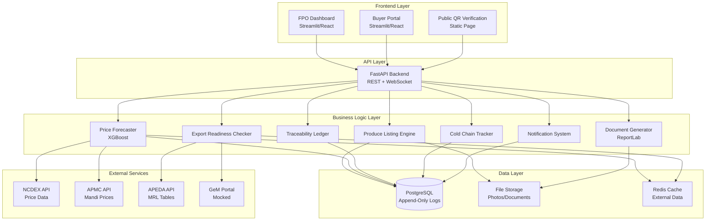

# Design Document: AgroVault Web MVP

## Overview

AgroVault is an AI-powered export intelligence platform for India's Farmer Producer Organizations (FPOs). The web MVP provides a dual-interface system: an FPO Dashboard for produce management and a Buyer Portal for discovery and procurement. The platform combines price forecasting, export readiness validation, traceability tracking, and document generation to streamline agricultural exports.

### Core Value Proposition

- FPOs gain AI-driven price intelligence to optimize sell timing
- Buyers access verified, export-ready produce with complete traceability
- Automated compliance documentation reduces export friction
- Append-only audit logs provide blockchain-equivalent transparency

### MVP Scope and Constraints

This is a hackathon MVP optimized for rapid development and demo-ability:

- Streamlit-first approach for fastest prototyping (React/Tailwind optional if time permits)
- Mock GeM Portal API responses (no live integration)
- Manual temperature entry for cold chain (no IoT sensors)
- Manual grade entry (no AI grading model)
- Append-only PostgreSQL for traceability (blockchain-equivalent for demo)
- Focus on core workflows: lot creation, price forecasting, buyer search, negotiation

## Architecture

### System Architecture



### Technology Stack

**Backend:**
- FastAPI (Python 3.10+) - REST API and WebSocket server
- Pydantic - Request/response validation
- SQLAlchemy - ORM for PostgreSQL
- Alembic - Database migrations

**ML/AI:**
- XGBoost - Price forecasting model
- scikit-learn - Data preprocessing and feature engineering
- pandas/numpy - Data manipulation

**Database:**
- PostgreSQL 14+ - Primary data store with append-only constraints
- Redis (optional) - Caching layer for external API data

**Document Generation:**
- ReportLab - PDF generation for export documents
- qrcode - QR code generation
- Pillow - Image processing and resizing

**Frontend:**
- Streamlit (primary) - Rapid prototyping for both dashboards
- React + Tailwind CSS (optional) - If time permits after core features
- Chart.js or Plotly - Data visualization

**Deployment:**
- Railway or Render - Free tier hosting
- PostgreSQL managed instance
- Static file serving via platform CDN

### Design Principles

1. **Speed over perfection**: Streamlit forms and tables over custom React components
2. **Mock external dependencies**: GeM Portal responses, IoT sensors
3. **Append-only for traceability**: PostgreSQL constraints simulate blockchain
4. **Minimal authentication**: Simple role-based access (FPO Manager, Buyer, Admin)
5. **Offline-tolerant**: Browser storage for lot creation, sync when online

## Components and Interfaces

### 1. Produce Listing Engine

**Responsibility:** Create and manage produce lots with photos and metadata

**Public Interface:**
```python
class ProduceListingEngine:
    def create_lot(
        self,
        fpo_id: str,
        crop_type: str,
        quantity: float,
        unit: str,
        harvest_date: date,
        location: str,
        photos: List[UploadFile],
        grade: str,
        language: str = "en"
    ) -> Lot:
        """Create a new produce lot with auto-generated Lot_ID and QR code"""
        
    def create_lots_bulk(
        self,
        fpo_id: str,
        csv_file: UploadFile
    ) -> BulkUploadResult:
        """Create multiple lots from CSV file"""
        
    def generate_lot_id(self, crop_type: str, harvest_date: date) -> str:
        """Generate Lot_ID in format CROP-YYYYMMDD-XXXX"""
        
    def generate_qr_code(self, lot_id: str) -> bytes:
        """Generate QR code image encoding Lot_ID and verification URL"""
        
    def process_photos(
        self,
        photos: List[UploadFile],
        lot_id: str
    ) -> List[PhotoRecord]:
        """Resize, compress, and store photos with thumbnails"""
```

**Dependencies:**
- Database: lots table, photos table
- File Storage: photo uploads
- QR Library: qrcode Python package

**Key Behaviors:**
- Lot_ID format: `{CROP}-{YYYYMMDD}-{XXXX}` where XXXX is daily sequential counter
- Photo processing: resize to 1200px max width, compress to <500KB, generate 300px thumbnails
- QR code encodes: `https://agrovault.app/verify/{lot_id}`
- Multi-language support: crop type and location fields accept Hindi/Marathi input

### 2. Price Forecaster

**Responsibility:** Generate price predictions using XGBoost model trained on market data

**Public Interface:**
```python
class PriceForecaster:
    def forecast_price(
        self,
        crop_type: str,
        forecast_days: List[int] = [7, 14, 21]
    ) -> PriceForecast:
        """Generate price predictions with confidence intervals"""
        
    def recommend_sell_window(
        self,
        crop_type: str,
        current_quantity: float
    ) -> SellRecommendation:
        """Recommend optimal sell timing based on forecast peak"""
        
    def fetch_training_data(self) -> None:
        """Fetch NCDEX and APMC data for model training (daily at 06:00 IST)"""
        
    def train_model(self, crop_type: str) -> None:
        """Train XGBoost model on historical price data"""
```

**Dependencies:**
- External APIs: NCDEX spot/futures, APMC mandi prices
- Database: price_history table
- Cache: Redis for daily price data (24h TTL)

**Model Architecture:**
- XGBoost regressor with time-series features
- Features: historical prices, futures prices, seasonality, market volume
- Training: weekly retraining on rolling 2-year window
- Confidence intervals: quantile regression (10th, 50th, 90th percentiles)

**Data Sources:**
- NCDEX: spot prices and futures contracts
- APMC: mandi modal prices from data.gov.in
- Update frequency: daily at 06:00 IST

### 3. Export Readiness Checker

**Responsibility:** Validate produce against international export standards

**Public Interface:**
```python
class ExportReadinessChecker:
    def check_readiness(
        self,
        lot_id: str,
        target_markets: List[str]
    ) -> ExportReadinessReport:
        """Validate lot against APEDA MRL and target market standards"""
        
    def validate_mrl(
        self,
        crop_type: str,
        pesticide_residues: Dict[str, float],
        target_market: str
    ) -> MRLValidationResult:
        """Check pesticide residue levels against MRL limits"""
        
    def validate_fssai_license(self, fpo_id: str) -> bool:
        """Verify FPO has valid FSSAI license"""
        
    def get_remediation_guidance(
        self,
        validation_result: ExportReadinessReport
    ) -> List[RemediationStep]:
        """Provide actionable steps to meet failed standards"""
```

**Dependencies:**
- External APIs: APEDA MRL tables (weekly refresh)
- Database: export_standards table, fpo_licenses table
- Cache: MRL tables (7-day TTL)

**Validation Logic:**
- Supported markets: UAE, EU, US
- Grade-specific MRL: Grade A has stricter limits than B/C
- FSSAI license: check expiry date and registration status
- Remediation: specific guidance on which standards failed and how to address

### 4. Traceability Ledger

**Responsibility:** Maintain immutable audit log of lot lifecycle events

**Public Interface:**
```python
class TraceabilityLedger:
    def append_event(
        self,
        lot_id: str,
        event_type: str,
        actor: str,
        location: str,
        metadata: Dict[str, Any]
    ) -> TraceabilityEvent:
        """Append event to lot's audit log (immutable)"""
        
    def get_timeline(self, lot_id: str) -> List[TraceabilityEvent]:
        """Retrieve chronological audit log for a lot"""
        
    def verify_integrity(self, lot_id: str) -> bool:
        """Verify audit log has not been tampered with"""
```

**Dependencies:**
- Database: traceability_events table with append-only constraint

**Event Types:**
- `farm_input`: Seed, fertilizer, pesticide application
- `harvest`: Harvest completion with date/time
- `cold_storage_entry`: Entry into cold storage with temperature
- `cold_storage_exit`: Exit from cold storage
- `transport`: Movement between locations with GPS
- `buyer_handoff`: Transfer to buyer

**Append-Only Implementation:**
```sql
CREATE TABLE traceability_events (
    id SERIAL PRIMARY KEY,
    lot_id VARCHAR(50) NOT NULL,
    event_number INT NOT NULL,
    event_type VARCHAR(50) NOT NULL,
    timestamp TIMESTAMPTZ NOT NULL DEFAULT NOW(),
    actor VARCHAR(100) NOT NULL,
    location VARCHAR(200),
    gps_lat DECIMAL(10, 8),
    gps_lon DECIMAL(11, 8),
    metadata JSONB,
    created_at TIMESTAMPTZ NOT NULL DEFAULT NOW(),
    CONSTRAINT no_updates CHECK (created_at = NOW()),
    CONSTRAINT sequential_events UNIQUE (lot_id, event_number)
);

-- Prevent updates and deletes
CREATE RULE no_update AS ON UPDATE TO traceability_events DO INSTEAD NOTHING;
CREATE RULE no_delete AS ON DELETE TO traceability_events DO INSTEAD NOTHING;
```

### 5. Cold Chain Tracker

**Responsibility:** Monitor storage conditions and shelf life for perishable produce

**Public Interface:**
```python
class ColdChainTracker:
    def record_entry(
        self,
        lot_id: str,
        temperature: float,
        expected_shelf_life_days: int
    ) -> ColdChainRecord:
        """Record cold storage entry"""
        
    def record_temperature(
        self,
        lot_id: str,
        temperature: float
    ) -> None:
        """Record temperature reading (manual entry for MVP)"""
        
    def check_alerts(self, lot_id: str) -> List[Alert]:
        """Check for temperature violations or shelf life warnings"""
        
    def record_exit(self, lot_id: str, temperature: float) -> None:
        """Record cold storage exit"""
        
    def calculate_remaining_shelf_life(self, lot_id: str) -> float:
        """Calculate remaining shelf life percentage"""
```

**Dependencies:**
- Database: cold_chain_records table, temperature_readings table

**Temperature Thresholds (by crop):**
- Mango: 12-14°C
- Pomegranate: 5-7°C
- Onion: 0-4°C
- Grape: 0-2°C

**Alert Logic:**
- Temperature violation: current temp outside safe range for crop
- Shelf life warning: storage duration > 80% of expected shelf life
- Degradation risk: temperature violation duration > 2 hours

### 6. Document Generator

**Responsibility:** Generate export compliance documents as PDFs

**Public Interface:**
```python
class DocumentGenerator:
    def generate_phytosanitary_certificate(
        self,
        lot_id: str,
        buyer_info: BuyerInfo
    ) -> bytes:
        """Generate phytosanitary certificate PDF"""
        
    def generate_apeda_rcmc_form(
        self,
        lot_id: str,
        fpo_id: str
    ) -> bytes:
        """Generate APEDA RCMC form PDF"""
        
    def generate_export_invoice(
        self,
        lot_id: str,
        buyer_info: BuyerInfo,
        price: float
    ) -> bytes:
        """Generate export invoice PDF"""
        
    def generate_certificate_of_analysis(
        self,
        lot_id: str
    ) -> bytes:
        """Generate Certificate of Analysis PDF"""
        
    def generate_fssai_compliance_statement(
        self,
        fpo_id: str
    ) -> bytes:
        """Generate FSSAI compliance statement PDF"""
        
    def generate_all_documents(
        self,
        lot_id: str,
        buyer_info: BuyerInfo,
        price: float
    ) -> Dict[str, bytes]:
        """Generate all export documents in one call"""
```

**Dependencies:**
- ReportLab: PDF generation
- Database: lots, fpos, buyers tables
- QR codes: embedded in each document

**Document Templates:**
- APEDA-approved layouts for phytosanitary certificates
- FSSAI official format for compliance statements
- Standard export invoice format with INR currency
- Date format: DD/MM/YYYY
- Currency format: ₹1,25,000 (Indian thousand separators)

### 7. Notification System

**Responsibility:** Deliver real-time notifications for bids, alerts, and updates

**Public Interface:**
```python
class NotificationSystem:
    def send_notification(
        self,
        user_id: str,
        notification_type: str,
        title: str,
        message: str,
        link: str = None
    ) -> Notification:
        """Send notification to user"""
        
    def get_unread_count(self, user_id: str) -> int:
        """Get count of unread notifications"""
        
    def mark_as_read(self, notification_id: str) -> None:
        """Mark notification as read"""
        
    def get_notifications(
        self,
        user_id: str,
        limit: int = 50
    ) -> List[Notification]:
        """Retrieve user notifications"""
```

**Dependencies:**
- Database: notifications table
- WebSocket: real-time push to connected clients
- Email: SMTP for email notifications (optional for MVP)

**Notification Types:**
- `new_bid`: New bid received on FPO's lot
- `bid_accepted`: Buyer's bid accepted by FPO
- `counter_offer`: FPO sent counter-offer
- `cold_chain_alert`: Temperature violation or shelf life warning
- `lot_sold`: Lot marked as sold

### 8. API Layer

**REST Endpoints:**

```
POST   /api/v1/lots                    # Create lot
POST   /api/v1/lots/bulk               # Bulk lot creation
GET    /api/v1/lots                    # List lots (with filters)
GET    /api/v1/lots/{lot_id}           # Get lot details
PATCH  /api/v1/lots/{lot_id}           # Update lot (limited fields)

GET    /api/v1/forecast/{crop_type}    # Get price forecast
GET    /api/v1/forecast/{crop_type}/recommend  # Get sell recommendation

POST   /api/v1/export-check            # Check export readiness
GET    /api/v1/export-check/{lot_id}   # Get readiness report

GET    /api/v1/traceability/{lot_id}   # Get audit log
POST   /api/v1/traceability/event      # Append event

POST   /api/v1/cold-chain/entry        # Record cold storage entry
POST   /api/v1/cold-chain/temperature  # Record temperature
POST   /api/v1/cold-chain/exit         # Record cold storage exit
GET    /api/v1/cold-chain/{lot_id}     # Get cold chain history

POST   /api/v1/documents/generate      # Generate export documents
GET    /api/v1/documents/{doc_id}      # Download document

POST   /api/v1/bids                    # Submit bid
GET    /api/v1/bids                    # List bids (filtered by user)
PATCH  /api/v1/bids/{bid_id}           # Accept/counter/decline bid

GET    /api/v1/notifications           # Get notifications
PATCH  /api/v1/notifications/{id}/read # Mark as read

POST   /api/v1/auth/login              # Login
POST   /api/v1/auth/logout             # Logout
GET    /api/v1/auth/me                 # Get current user

GET    /api/v1/analytics/kpis          # Get dashboard KPIs
GET    /api/v1/analytics/price-heatmap # Get price heatmap data
GET    /api/v1/analytics/timeline      # Get lot timeline data

POST   /api/v1/export/lots             # Export lots as CSV
POST   /api/v1/export/transactions     # Export transactions as CSV
POST   /api/v1/export/analytics        # Export analytics as PDF

GET    /api/v1/verify/{lot_id}         # Public QR verification
```

**WebSocket Endpoints:**
```
/ws/dashboard/{fpo_id}    # Real-time KPI updates
/ws/bids/{user_id}        # Real-time bid notifications
```

**Error Response Format:**
```json
{
  "error_code": "VALIDATION_ERROR",
  "message": "Invalid crop type",
  "details": {
    "field": "crop_type",
    "expected": "One of: mango, pomegranate, onion, grape, ...",
    "received": "tomato"
  }
}
```

**Rate Limiting:**
- 100 requests per minute per user
- 429 Too Many Requests response with Retry-After header

## Data Models

### Core Entities

**Lot:**
```python
class Lot(BaseModel):
    lot_id: str                    # CROP-YYYYMMDD-XXXX
    fpo_id: str
    crop_type: str
    quantity: float
    unit: str                      # kg, quintal, ton
    harvest_date: date
    location: str
    grade: str                     # A, B, C
    grade_method: str              # manual, ai_assisted
    grade_confidence: float | None
    status: str                    # available, in_negotiation, sold
    min_price: float               # Minimum acceptable price
    photos: List[str]              # URLs to photo files
    qr_code_url: str
    export_ready_markets: List[str]  # UAE, EU, US
    created_at: datetime
    updated_at: datetime
```

**PriceForecast:**
```python
class PriceForecast(BaseModel):
    crop_type: str
    forecast_date: date
    predictions: List[PricePrediction]
    optimal_sell_window: DateRange
    data_sources: List[str]        # NCDEX, APMC mandi names
    
class PricePrediction(BaseModel):
    days_ahead: int                # 7, 14, 21
    predicted_price: float
    confidence_interval_low: float
    confidence_interval_high: float
```

**ExportReadinessReport:**
```python
class ExportReadinessReport(BaseModel):
    lot_id: str
    checked_at: datetime
    results: List[MarketValidation]
    
class MarketValidation(BaseModel):
    market: str                    # UAE, EU, US
    passed: bool
    checks: List[ComplianceCheck]
    remediation_steps: List[str]
    
class ComplianceCheck(BaseModel):
    check_type: str                # mrl, fssai_license, grade_requirement
    passed: bool
    details: str
```

**TraceabilityEvent:**
```python
class TraceabilityEvent(BaseModel):
    id: int
    lot_id: str
    event_number: int              # Sequential starting from 1
    event_type: str                # farm_input, harvest, cold_storage_entry, etc.
    timestamp: datetime
    actor: str                     # User ID or system
    location: str
    gps_lat: float | None
    gps_lon: float | None
    metadata: Dict[str, Any]       # Event-specific data
    created_at: datetime           # Immutable timestamp
```

**ColdChainRecord:**
```python
class ColdChainRecord(BaseModel):
    lot_id: str
    entry_timestamp: datetime
    entry_temperature: float
    expected_shelf_life_days: int
    exit_timestamp: datetime | None
    exit_temperature: float | None
    temperature_readings: List[TemperatureReading]
    alerts: List[Alert]
    
class TemperatureReading(BaseModel):
    timestamp: datetime
    temperature: float
    recorded_by: str
    
class Alert(BaseModel):
    alert_type: str                # temperature_violation, shelf_life_warning
    triggered_at: datetime
    severity: str                  # warning, critical
    message: str
```

**Bid:**
```python
class Bid(BaseModel):
    bid_id: str
    lot_id: str
    buyer_id: str
    amount: float
    quantity: float
    delivery_terms: str
    status: str                    # pending, accepted, countered, declined
    submitted_at: datetime
    responded_at: datetime | None
    counter_offers: List[CounterOffer]
    
class CounterOffer(BaseModel):
    amount: float
    quantity: float
    offered_by: str                # fpo or buyer
    offered_at: datetime
```

**User:**
```python
class User(BaseModel):
    user_id: str
    email: str
    role: str                      # fpo_manager, buyer, admin
    fpo_id: str | None             # For FPO managers
    language_preference: str       # en, hi, mr
    created_at: datetime
    last_login: datetime
```

**FPO:**
```python
class FPO(BaseModel):
    fpo_id: str
    name: str
    registration_number: str
    fssai_license: str
    apeda_rcmc: str
    location: str
    state: str
    district: str
    member_count: int
    created_at: datetime
```

### Database Schema

**Key Tables:**
- `lots`: Produce lot records
- `photos`: Photo metadata and URLs
- `price_history`: Historical price data from NCDEX/APMC
- `price_forecasts`: Cached forecast results
- `export_standards`: APEDA MRL tables and market requirements
- `traceability_events`: Append-only audit log
- `cold_chain_records`: Cold storage tracking
- `temperature_readings`: Temperature measurements
- `bids`: Buyer bids and negotiations
- `notifications`: User notifications
- `users`: User accounts and roles
- `fpos`: FPO organization records
- `documents`: Generated document metadata

**Indexes:**
- `lots(crop_type, status, fpo_id)`
- `lots(status, created_at)`
- `traceability_events(lot_id, event_number)`
- `bids(lot_id, status)`
- `bids(buyer_id, status)`
- `notifications(user_id, read_at)`

**Connection Pooling:**
- Min connections: 10
- Max connections: 50
- Connection timeout: 30 seconds

## Correctness Properties

